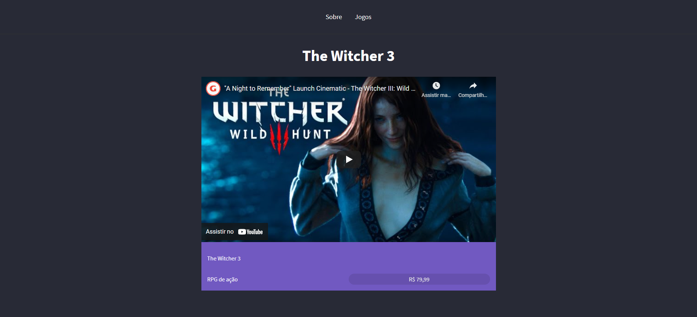

# MyGames


## 📝 Sobre

**MyGames** é site simples para mostrar meus jogos favoritos
  

---------


## 🖥️ Demonstração

<h1>
     

<h1>
    

----------


## 🚀 Tecnologias e ferramentas utilizadas

- **HTML5**
- **CSS3**
- **JavaScript**
- **NodeJS**
- **Express**
- **Templating engine (Nunjucks)**

----


## 💻 Instalação e uso

```bash
# Abra um terminal e copie este repositório com o comando
$ git clone https://github.com/RodrigoFonsecaG/MyGames.git
# ou use a opção de download.

# Entre na pasta do projeto 
$ cd MyGames

# Instale as dependências
$ npm install

# Rode o aplicação
$ npm start

#Por fim acesse o localhost:3000 no seu navegador.
```

----


**Desenvolvido por [Rodrigo Fonseca](https://github.com/RodrigoFonsecaG/).**
